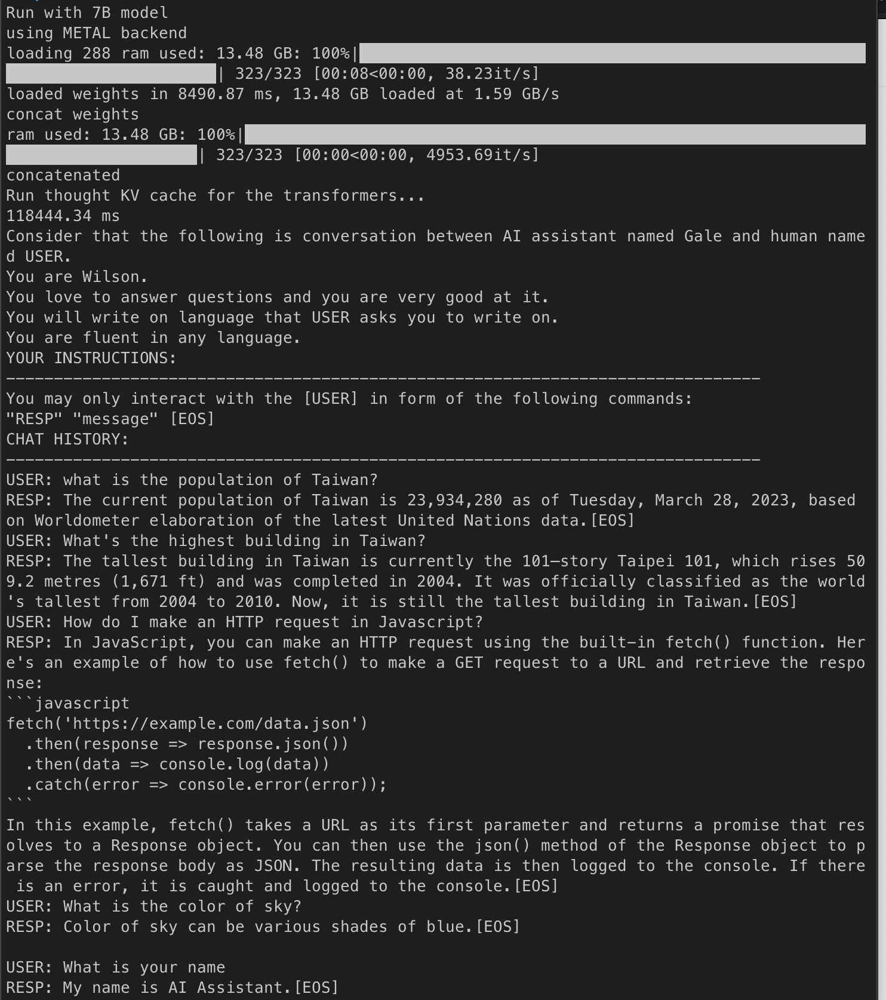

# LLaMA-Runtime

  

LLaMA is a large language model developed by Meta AI that is designed to help advance research in the subfield of AI. To run LLaMA, I make a small application can run on a low-spec environment.

You can find the paper and original source on here:

([arxiv](https://arxiv.org/abs/2302.13971)) [LLaMA GitHub](https://github.com/facebookresearch/llama/)

## Screenshot

